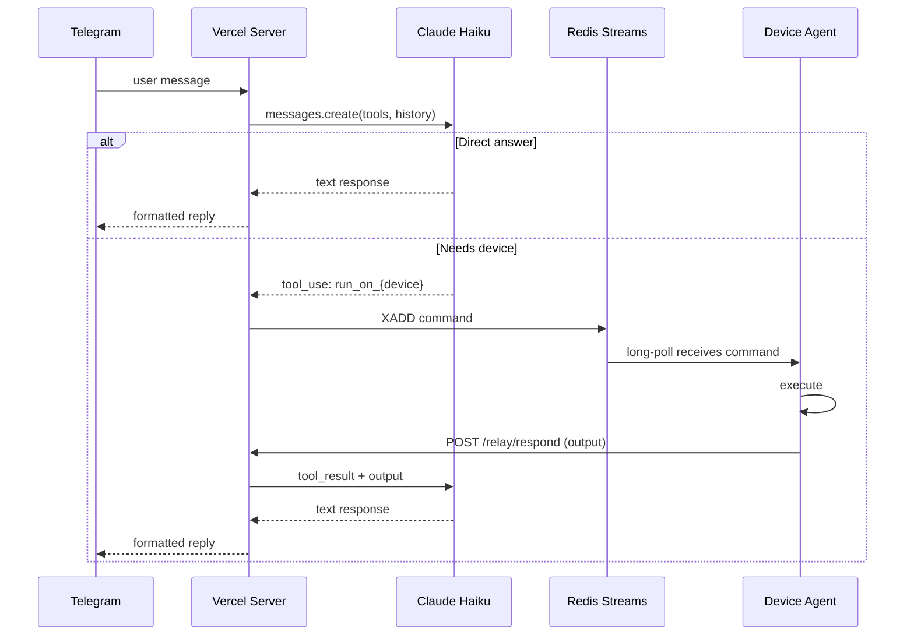
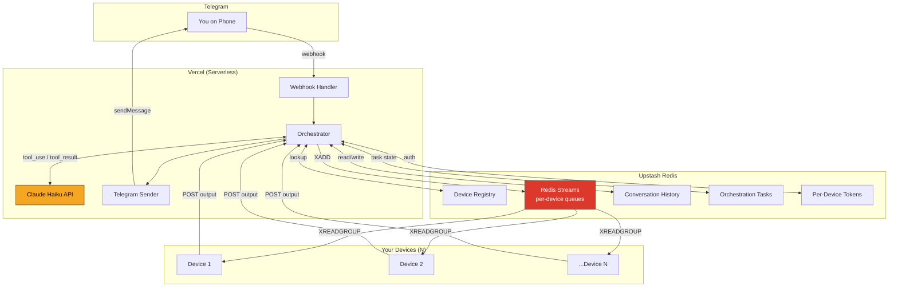

<h1 align="center">Yuna</h1>

<p align="center">
  <strong>AI-powered multi-device orchestrator over Telegram. Self-hosted.</strong>
</p>

<p align="center">
  
  
  
  
  
</p>

---

Send a message from your phone. Claude on the server decides what to do — answer directly, or run commands on your devices. Devices don't run Claude. They're just hands. You pick the character.

```bash
npx yuna-bot init
```

The wizard walks you through Telegram, Anthropic, Upstash, and Vercel in about 5 minutes.

## How It Works



## Architecture



## Features

| Feature | Detail |
|---------|--------|
| **Dynamic devices** | Add/remove at runtime — tools generated on the fly from registry |
| **Server-side Claude** | Haiku with `tool_use` — ~$0.001/msg, devices don't run Claude |
| **Per-device auth** | Each device has its own revocable UUID token, no shared secrets |
| **One-time setup codes** | 10min TTL single-use codes for device onboarding |
| **Agentic loops** | Multi-step tool use — Claude can chain commands across devices |
| **Device mesh** (opt-in) | SSH aliases enable direct `transfer_file` between devices |
| **Model overrides** | `@opus`, `@sonnet`, `@haiku` prefix to pick the model |
| **Reactions** | 👍 proceed / 👎 stop / 🔄 retry / 🚀 ship / ✅ confirm / ❌ cancel |
| **Outbound only** | No Tailscale, no VPN, no port forwarding — HTTPS out |
| **Audit log** | Every command + result in Redis, viewable via `/logs` |
| **Prompt caching** | System prompt cached between invocations |
| **Owner lock** | `TELEGRAM_OWNER_ID` restricts the bot to a single user |

## Install

```bash
# One-shot
npx yuna-bot init

# Or global
npm install -g yuna-bot
yuna init
```

The init wizard will:

1. Ask what to call your bot (you pick — it's your character)
2. Open @BotFather for a Telegram bot token
3. Open console.anthropic.com for an API key
4. Open console.upstash.com for a Redis database
5. Deploy the server to your Vercel account (or scaffold for manual deploy)
6. Register the Telegram webhook
7. Save your local config

Then on each device:

```bash
# On the init machine, via Telegram:
/create-code        → copy the code

# On the new device:
npm install -g yuna-bot
yuna add-device --code ABCD-1234 --url https://your-app.vercel.app
yuna start
```

Now message your bot from Telegram — Claude routes commands to whichever device makes sense.

## Usage

```
check disk usage                 → Claude picks a device and runs df -h
check battery on the laptop      → Claude picks the right device from context
copy the config from A to B      → Claude chains commands (mesh: direct SCP)
what's 2+2                       → Claude answers directly, no device
@opus explain this error         → Opus instead of Haiku
/status                          → Device list with online/offline
/reset                           → Clear conversation history
/create-code                     → New setup code for another device
/revoke laptop                   → Revoke a device's token
/logs                            → Recent audit log
```

## CLI

| Command | Description |
|---|---|
| `yuna init` | Deploy server, configure bot, wizard-guided setup |
| `yuna init --manual` | Scaffold server locally, you deploy manually |
| `yuna add-device --code X` | Register this machine as a device using a setup code |
| `yuna start` | Run the device agent (foreground) |
| `yuna status` | Show server health and device list |
| `yuna reset` | Clear conversation history |
| `yuna --help` | All commands |

## Self-Hosted

Yuna is 100% self-hosted. You deploy your own Vercel instance, use your own Anthropic API key, and use your own Upstash Redis database. There is no Yuna SaaS — there's just the code, and you run it.

| Service | Why | Cost |
|---|---|---|
| [Telegram Bot](https://t.me/BotFather) | Your chat interface | Free |
| [Anthropic API](https://console.anthropic.com) | Claude Haiku by default | ~$0.001/msg |
| [Upstash Redis](https://console.upstash.com) | Queues + state + audit log | Free tier: 10k cmds/day |
| [Vercel](https://vercel.com) | Server hosting | Free tier: 100k invocations/mo |

Typical cost for personal use: **under $5/month**, even heavy.

| Scenario | Per Message |
|----------|-------------|
| Direct answer (no device) | ~$0.001 |
| Single device command | ~$0.003 |
| Multi-step (3 commands) | ~$0.005 |
| `@opus` override | ~$0.05 |

## Project Structure

```
yuna/
├── bin/yuna.js                   ← CLI shim
├── src/
│   ├── cli/                      ← Commander-based CLI
│   │   ├── init.ts               ← Interactive wizard
│   │   ├── add-device.ts         ← Device registration
│   │   ├── start.ts              ← Launch device agent
│   │   ├── status.ts             ← Server + device status
│   │   └── helpers/              ← config, crypto, vercel, browser, api
│   ├── agent/
│   │   ├── agent.ts              ← Polling loop, exponential backoff
│   │   ├── executor.ts           ← bash / read_file / write_file / transfer_file
│   │   └── protocol.ts           ← Wire protocol types
│   └── shared/types.ts
└── server/                       ← Next.js on Vercel (deployed by wizard)
    ├── src/lib/
    │   ├── orchestrator.ts       ← Core: Claude API + agentic loop
    │   ├── tools.ts              ← Dynamic tool generation from registry
    │   ├── system-prompt.ts      ← Dynamic prompt per device
    │   ├── devices.ts            ← Device registry CRUD
    │   ├── auth.ts               ← Per-device tokens + setup codes
    │   ├── redis.ts              ← Streams, conversation, tasks, audit
    │   ├── telegram.ts           ← Bot API + md→HTML
    │   └── rate-limit.ts         ← Sliding window
    └── src/app/api/
        ├── health/               ← Redis ping
        ├── devices/              ← Device list
        ├── relay/poll/           ← Device long-poll
        ├── relay/respond/        ← Device output → continues loop
        ├── relay/register/       ← Setup-code registration
        ├── telegram/webhook/     ← Telegram → orchestrator
        └── telegram/setup/       ← One-time webhook registration
```

## Data Flow

```mermaid
flowchart LR
    subgraph Redis
        DEV[yuna:devices]
        S1[yuna:stream:device1]
        S2[yuna:stream:device2]
        C[yuna:conversation:messages]
        T[yuna:orchestration:*]
        L[yuna:lastseen:*]
        TOK[yuna:token:*]
        CODE[yuna:setup-code:*]
        LOG[yuna:log]
    end

    ORC[Orchestrator] <-->|lookup| DEV
    ORC -->|XADD| S1
    ORC -->|XADD| S2
    ORC <-->|GET/SET| C
    ORC <-->|GET/SET| T
    ORC -->|LPUSH| LOG
    D1[Device 1] -->|XREADGROUP| S1
    D2[Device 2] -->|XREADGROUP| S2
    D1 -->|SET| L
    D2 -->|SET| L
    REG[/relay/register] <-->|validate| CODE
    REG -->|issue| TOK
```

## Redis Key Schema

| Key | Type | Purpose |
|---|---|---|
| `yuna:devices` | SET | Registered device names |
| `yuna:device:{name}` | HASH | Device metadata (os, description, capabilities, ssh) |
| `yuna:token:{token}` | STRING | Per-device auth token → device identity |
| `yuna:device-token:{name}` | STRING | Reverse index for token revocation |
| `yuna:setup-code:{code}` | STRING | One-time device setup code (10min TTL) |
| `yuna:lastseen:{name}` | STRING | Device heartbeat timestamp |
| `yuna:stream:{name}` | STREAM | Per-device command queue (group: `agent`) |
| `yuna:conversation:messages` | STRING | Shared conversation history (JSON) |
| `yuna:orchestration:{taskId}` | STRING | In-flight agentic task state (5min TTL) |
| `yuna:log` | LIST | Audit log, capped at 1000 entries |
| `yuna:master` | STRING | Hashed master secret |

## Security

- **No shared secrets between devices.** Each device has its own UUID token.
- **Token revocation** is instant — delete the Redis key.
- **One-time setup codes** (10min TTL, single-use) prevent replay during registration.
- **Telegram webhook secret** prevents spoofed webhook calls.
- **Owner lock** — `TELEGRAM_OWNER_ID` restricts the bot to a single user.
- **Rate limiting** on the webhook prevents abuse.
- **Command execution** runs as the device agent's user (not root). Don't run the agent as root.
- **Outbound only** — devices never accept inbound connections.

## Development

```bash
git clone https://github.com/mikevitelli/yuna
cd yuna
npm install
npm run build:cli
node bin/yuna.js --help

cd server && npm install
npm run dev           # local server
npm run typecheck     # type check everything
```

See `PLAN.md` for the implementation roadmap and `CLAUDE.md` for the architecture guide that any Claude Code session can pick up from.

## Status

**v0.1 — Under active development.** Server and CLI are fully implemented and type-clean. End-to-end testing and npm publish are the next milestones. Not yet recommended for production use.

## License

MIT
